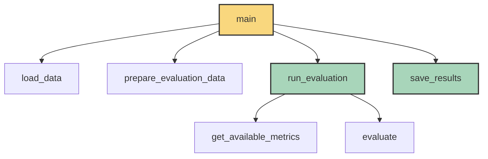
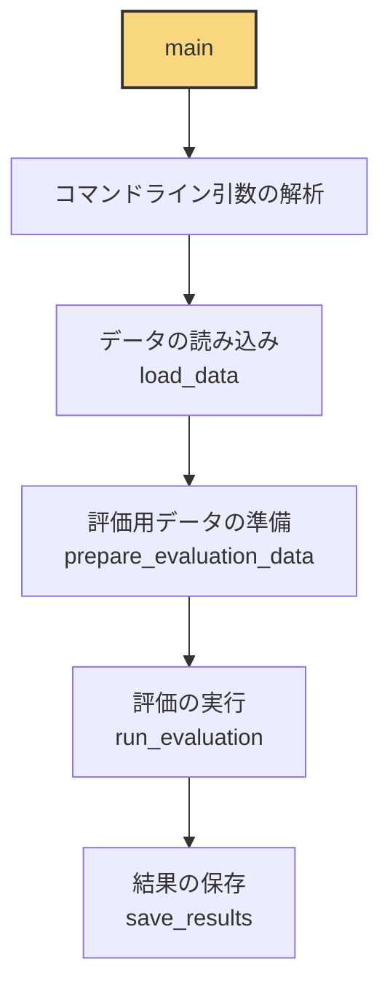
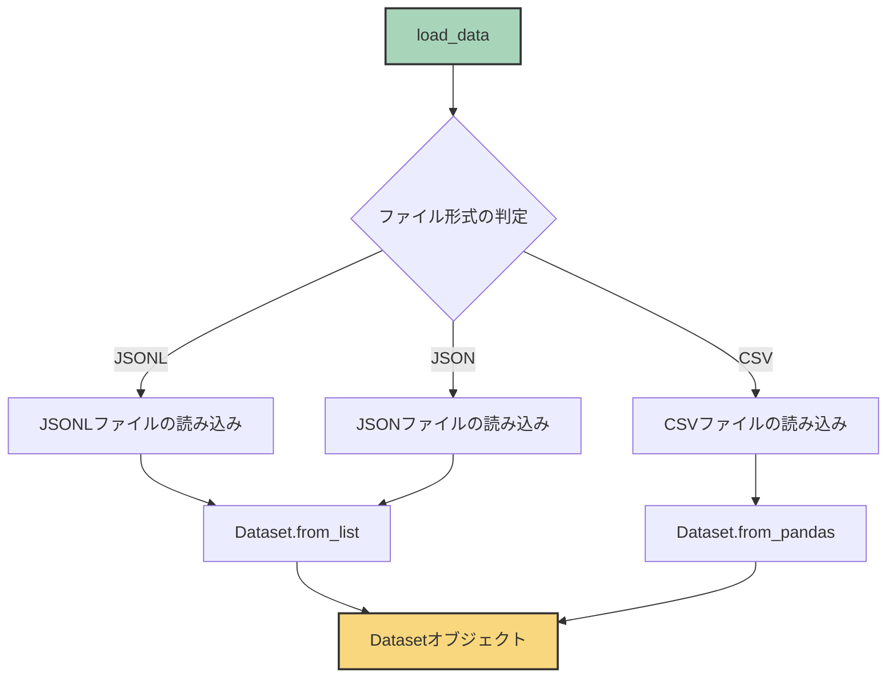
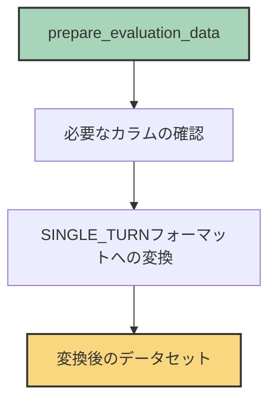
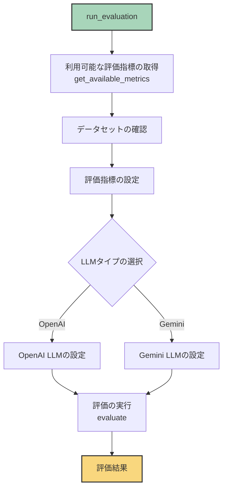
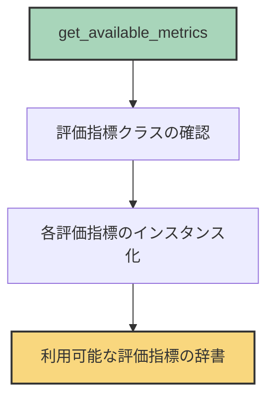
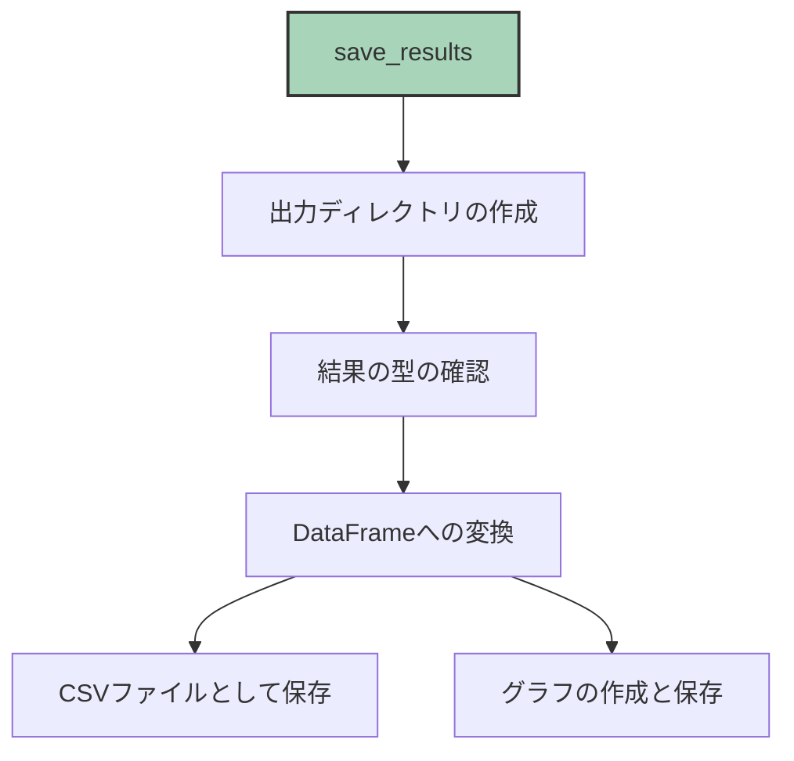
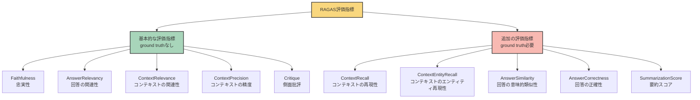
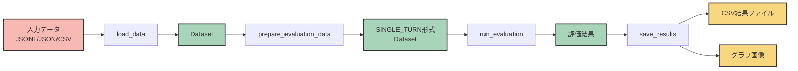

# RAGAS評価システム 関数構成図

このドキュメントでは、RAGAS評価システムの関数構成を図で説明します。

## 全体の処理フロー

## 関数の詳細説明

### main関数

### load_data関数

### prepare_evaluation_data関数

### run_evaluation関数

### get_available_metrics関数

### save_results関数

## 評価指標の関係

## データの流れ

